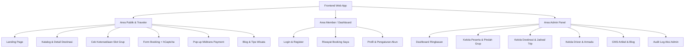
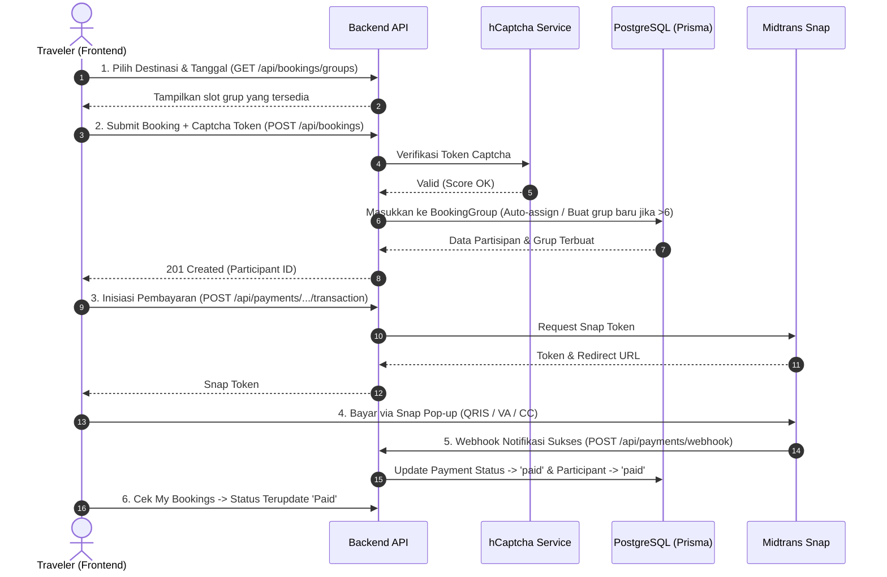
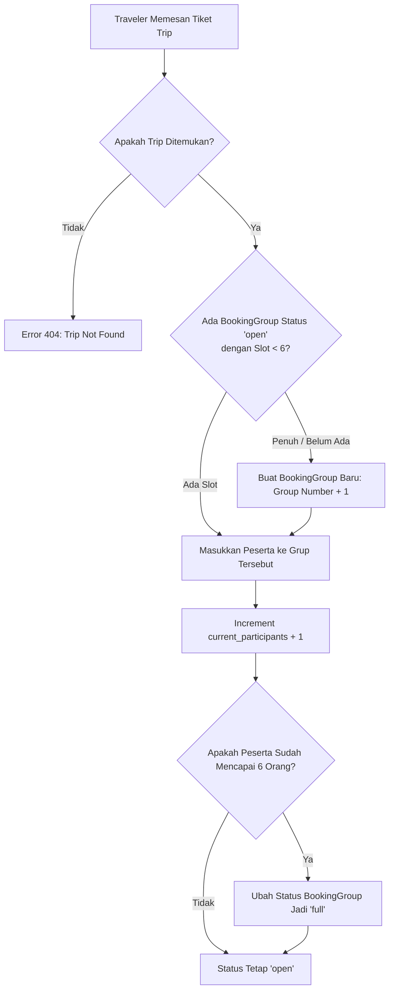
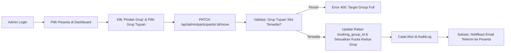

Berikut adalah ringkasan deskripsi, pemetaan halaman/fitur frontend, serta alur kerja (*flow*) sistem:

---

## 1. Deskripsi Singkat Aplikasi

**Trip Sharing** adalah platform web pariwisata berbasis *cost-sharing* (berbagi perjalanan). Platform ini memungkinkan traveler memesan kursi perjalanan wisata secara individu maupun kelompok kecil, yang kemudian secara otomatis digabungkan ke dalam satu grup mobil/trip bersama traveler lain (maksimal **6 peserta per grup**). 

Platform ini dilengkapi sistem *auto-grouping*, proteksi bot (*hCaptcha*), pembayaran otomatis (*Midtrans Snap*), serta portal admin untuk pengelolaan destinasi, driver, dan pemindahan peserta antar grup.

---

## 2. Peta Halaman & Fitur Frontend

### A. Area Publik & Pengunjung (Guest / Traveler)

1. **Halaman Beranda (*Landing Page*):**
   - Hero banner promosi paket trip sharing.
   - Daftar destinasi wisata unggulan & harga per orang.
   - Penjelasan cara kerja *trip-sharing* (hemat biaya & kenalan dengan teman baru).
   - Artikel wisata terbaru.
2. **Halaman Eksplorasi Destinasi (*Destinations List & Detail*):**
   - Filter destinasi berdasarkan lokasi & durasi.
   - Detail destinasi: itinerary harian, foto galeri, fasilitas yang didapat, dan harga per orang.
3. **Komponen Pemilih Tanggal & Slot Grup (*Trip Availability*):**
   - Kalender keberangkatan trip.
   - Indikator keterisian kursi grup (contoh: *Grup 1: 4/6 kursi terisi — sisa 2 kursi!*).
4. **Halaman Pemesanan (*Booking Form*):**
   - Form data diri: Nama, No. HP, Negara, Tanggal Lahir, No. Paspor/Identitas, Preferensi Kamar/Hotel, Catatan Kesehatan.
   - Pilihan asuransi perjalanan (*checkbox*).
   - Widget **hCaptcha** wajib untuk memvalidasi pemesan bukan bot.
5. **Modal Pembayaran (*Midtrans Snap Payment*):**
   - Pop-up Midtrans untuk transaksi langsung (QRIS, Transfer Bank/Virtual Account, Kartu Kredit).
6. **Halaman Artikel & Blog (*Articles / Blog*):**
   - Daftar artikel panduan dan tips wisata untuk kebutuhan SEO.

---

### B. Area Member (*Participant Dashboard*)

1. **Halaman Autentikasi (*Login & Register*):**
   - Formulir login dan registrasi peserta baru.
2. **Halaman Riwayat Booking Saya (*My Bookings*):**
   - Daftar riwayat trip yang sedang aktif dan yang sudah selesai.
   - Status pembayaran (`pending`, `paid`, `cancelled`).
   - Tombol *"Bayar Sekarang"* (jika pembayaran belum selesai).
   - Informasi detail grup trip dan status penjemputan.
3. **Halaman Profil Pengguna (*User Profile*):**
   - Pengaturan informasi akun dan kontak.

---

### C. Area Admin (*Admin Dashboard*)

1. **Dashboard Overview:**
   - Ringkasan metrik total trip aktif, okupansi peserta, dan status pembayaran.
2. **Manajemen Peserta (*Participant Management*):**
   - Daftar seluruh peserta per trip dan grup.
   - Tambah peserta manual (untuk pesanan offline / via WhatsApp).
   - **Fitur Pindah Grup (*Move Participant*):** Dropdown untuk memindahkan peserta dari satu `BookingGroup` ke `BookingGroup` lain jika ada perubahan jadwal.
   - Status Check-in peserta.
3. **Manajemen Destinasi & Trip (*Destinations & Trips CRUD*):**
   - Tambah/edit paket wisata, durasi, harga, dan itinerary.
   - Buat jadwal keberangkatan trip baru dan tetapkan pemandu (*guide*).
4. **Manajemen Driver & Armada (*Drivers CRUD*):**
   - Data driver, nomor SIM, tipe mobil, plat nomor, dan rating driver.
5. **Manajemen Artikel (*CMS Articles*):**
   - Editor konten artikel blog, kategori, dan metadata SEO.
6. **Audit Logs Viewer:**
   - Rekam jejak seluruh perubahan data yang dilakukan oleh admin.

---

## 3. Alur Pengguna (User & Business Flow)

### Flow 1: Alur Pemesanan & Pembayaran Traveler (Booking Flow)

---

### Flow 2: Alur Logika Auto-Grouping (Kapasitas Maksimal 6 Orang)

---

### Flow 3: Alur Admin Memindahkan Peserta Antar Grup (*Move Participant*)

