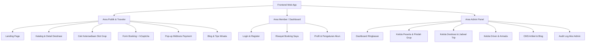
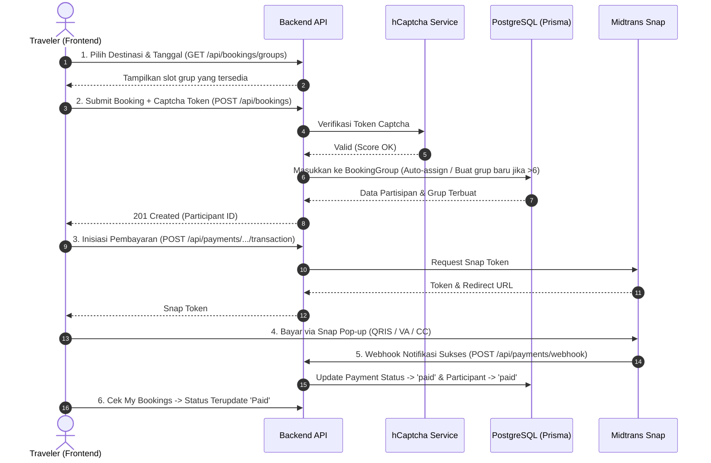
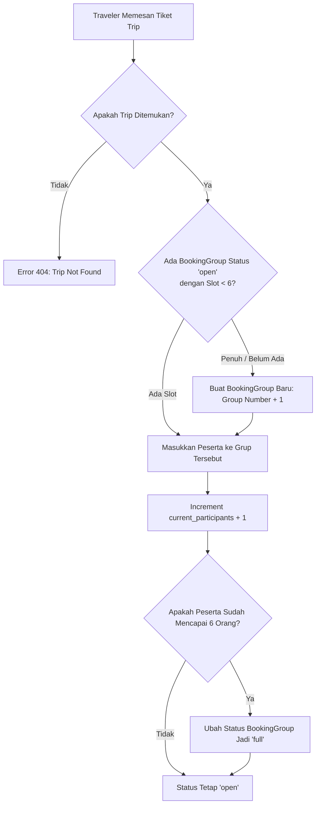
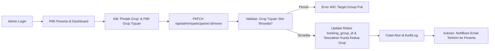

Berikut adalah ringkasan deskripsi, pemetaan halaman/fitur frontend, alur kerja (*flow*) sistem, prinsip Mobile-First Design, serta spesifikasi arsitektur SEO & Social Sharing:

---

## 1. Deskripsi Singkat Aplikasi

**Trip Sharing** adalah platform web pariwisata berbasis *cost-sharing* (berbagi perjalanan). Platform ini memungkinkan traveler memesan kursi perjalanan wisata secara individu maupun kelompok kecil, yang kemudian secara otomatis digabungkan ke dalam satu grup mobil/trip bersama traveler lain (maksimal **6 peserta per grup**). 

Platform ini dilengkapi sistem *auto-grouping*, proteksi bot (*hCaptcha*), pembayaran otomatis (*Midtrans Snap*), serta portal admin untuk pengelolaan destinasi, driver, dan pemindahan peserta antar grup.

---

## 2. Peta Halaman & Fitur Frontend

### A. Area Publik & Pengunjung (Guest / Traveler)

1. **Halaman Beranda (*Landing Page*):**
   - Hero banner promosi paket trip sharing dengan gambar LCP prioritas tinggi.
   - Daftar destinasi wisata unggulan & harga per orang.
   - Penjelasan cara kerja *trip-sharing* (hemat biaya & kenalan dengan teman baru).
   - Artikel wisata terbaru.
2. **Halaman Eksplorasi Destinasi (*Destinations List & Detail*):**
   - Filter destinasi berdasarkan lokasi & durasi.
   - Detail destinasi: itinerary harian, foto galeri, fasilitas yang didapat, dan harga per orang.
3. **Komponen Pemilih Tanggal & Slot Grup (*Trip Availability*):**
   - Kalender keberangkatan trip.
   - Indikator keterisian kursi grup (contoh: *Grup 1: 4/6 kursi terisi — sisa 2 kursi!*).
4. **Halaman Pemesanan (*Booking Form*):**
   - Form data diri: Nama, No. HP, Negara, Tanggal Lahir, No. Paspor/Identitas, Preferensi Kamar/Hotel, Catatan Kesehatan.
   - Pilihan asuransi perjalanan (*checkbox*).
   - Widget **hCaptcha** wajib untuk memvalidasi pemesan bukan bot.
5. **Modal Pembayaran (*Midtrans Snap Payment*):**
   - Pop-up Midtrans untuk transaksi langsung (QRIS, Transfer Bank/Virtual Account, Kartu Kredit).
6. **Halaman Artikel & Blog (*Articles / Blog*):**
   - Daftar artikel panduan dan tips wisata untuk kebutuhan SEO & social sharing.

---

### B. Area Member (*Participant Dashboard*)

1. **Halaman Autentikasi (*Login & Register*):**
   - Formulir login dan registrasi peserta baru.
2. **Halaman Riwayat Booking Saya (*My Bookings*):**
   - Daftar riwayat trip yang sedang aktif dan yang sudah selesai.
   - Status pembayaran (`pending`, `paid`, `cancelled`).
   - Tombol *"Bayar Sekarang"* (jika pembayaran belum selesai).
   - E-Voucher digital dengan QR Code untuk penjemputan driver.
3. **Halaman Profil Pengguna (*User Profile*):**
   - Pengaturan informasi akun dan kontak.

---

### C. Area Admin (*Admin Dashboard*)

1. **Dashboard Overview:**
   - Ringkasan metrik total trip aktif, okupansi peserta, dan status pembayaran.
2. **Manajemen Peserta (*Participant Management*):**
   - Daftar seluruh peserta per trip dan grup.
   - Tambah peserta manual (untuk pesanan offline / via WhatsApp).
   - **Fitur Pindah Grup (*Move Participant*):** Dropdown untuk memindahkan peserta dari satu `BookingGroup` ke `BookingGroup` lain jika ada perubahan jadwal.
   - Status Check-in peserta.
3. **Manajemen Destinasi & Trip (*Destinations & Trips CRUD*):**
   - Tambah/edit paket wisata, durasi, harga, dan itinerary.
   - Buat jadwal keberangkatan trip baru dan tetapkan pemandu (*guide*).
4. **Manajemen Driver & Armada (*Drivers CRUD*):**
   - Data driver, nomor SIM, tipe mobil, plat nomor, dan rating driver.
5. **Manajemen Artikel (*CMS Articles*):**
   - Editor konten artikel blog, kategori, dan metadata SEO.
6. **Audit Logs Viewer:**
   - Rekam jejak seluruh perubahan data yang dilakukan oleh admin.

---

## 3. Alur Pengguna (User & Business Flow)

### Flow 1: Alur Pemesanan & Pembayaran Traveler (Booking Flow)

---

### Flow 2: Alur Logika Auto-Grouping (Kapasitas Maksimal 6 Orang)

---

### Flow 3: Alur Admin Memindahkan Peserta Antar Grup (*Move Participant*)

---

## 4. Prinsip Desain Mobile-First & Target Core Web Vitals

Aplikasi didesain mengutamakan pengalaman pengguna di perangkat layar kecil (*mobile smartphones*) sebelum diekspansi ke tablet dan desktop.

### A. Aturan Desain Mobile-First (Design System Standards)
1. **Touch Target Accessibility:** Setiap elemen interaktif (tombol, input, link nav, checkbox) memiliki area sentuh minimal **$44 \times 44\text{ px}$** untuk mencegah salah klik pada jempol pengguna.
2. **Thumb-Zone Navigation:** Aksi-aksi utama seperti tombol CTA *"Booking Sekarang"*, filter destinasi, dan tombol bayar mudah dijangkau satu tangan pada layar ponsel.
3. **Zero Cumulative Layout Shift (CLS < 0.1):**
   - Seluruh kontainer gambar wajib menggunakan rasio aspek terkunci (`aspect-[16/10]`, `aspect-[4/3]`, atau `aspect-video`).
   - Menggunakan skeleton loader berukuran sama persis dengan kartu konten asli agar tidak terjadi pergeseran tata letak saat data selesai dimuat.
4. **Fast Mobile LCP (Largest Contentful Paint < 2.0s pada koneksi 4G):**
   - Gambar Hero utama dimuat dengan atribut `priority={true}` dan `sizes="(max-width: 768px) 100vw, 50vw"`.
   - Menggunakan format WebP modern yang dikompresi otomatis oleh Next.js Image Optimization.
5. **High Color Contrast Ratio (WCAG AA Compliant):**
   - Rasio kontras teks terhadap latar belakang minimal 4.5:1 untuk teks normal dan 3:1 untuk teks tebal/besar.

---

## 5. Mesin SEO, Social Graph & Rich Snippets Metadata

Platform ini menerapkan arsitektur SEO tingkat lanjut agar konten destinasi dan artikel memiliki pratinjau kaya (*Rich Social Previews*) saat dibagikan ke WhatsApp, Telegram, Facebook, X (Twitter), dan LinkedIn:

### A. Dynamic OpenGraph & Twitter Cards
1. **OpenGraph Protocol:**
   - `og:title`: Judul dinamis (Contoh: *"Open Trip Bromo Sunrise Safari (Maks 6 Pax) — Trip Sharing Platform"*).
   - `og:description`: Ringkasan itinerary, harga per orang, dan USP 6-pax auto grouping.
   - `og:image`: Gambar lanskap resolusi tinggi ($1200 \times 630\text{ px}$) dari destinasi atau artikel blog terkait.
   - `og:type`: `'website'` untuk halaman katalog/kategori, `'article'` untuk halaman detail blog wisata.
   - `og:site_name`: *"TripSharing Indonesia"*.
2. **Twitter Summary Large Image:**
   - `twitter:card`: `'summary_large_image'`.
   - `twitter:title`, `twitter:description`, `twitter:image`.

### B. JSON-LD Structured Data (Schema.org)
1. **Schema `TouristTrip` (Halaman Destinasi):**
   - Nama paket wisata, provider organisasi, harga tiket per orang (`offers.price`, `offers.priceCurrency: IDR`), durasi trip, lokasi tujuan (`itinerary`, `touristType`).
2. **Schema `BlogPosting` / `Article` (Halaman Blog):**
   - Judul, tanggal publikasi (`datePublished`), tanggal modifikasi (`dateModified`), nama penulis (`author.name`), gambar utama (`image`), dan deskripsi artikel.
3. **Schema `BreadcrumbList`:**
   - Navigasi remah roti berjenjang (`Home > Destinasi > Bromo Sunrise`) untuk memudahkan mesin pencari mengindeks struktur situs.

### C. Search Engine Indexing Assets
- **`sitemap.xml` (`app/sitemap.ts`):** Mengindeks otomatis seluruh rute statis, rute destinasi dinamis, dan rute artikel blog.
- **`robots.txt` (`app/robots.ts`):** Memberikan izin crawl ke area publik (`/`, `/destinations/*`, `/blog/*`) dan memblokir area rahasia (`/admin/*`, `/api/*`).